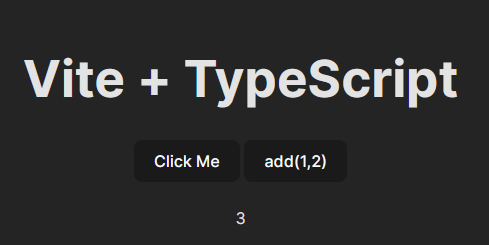

<h2>Motivation</h2>
How can you unit test your UI ?




<h2>Solution</h2>
Using vitest and jsdom it is very easy to test what is in the dom and even click button and check result


<h2>Setup</h2>

```
pnpm i
```

<h2>Usage</h2>

```
npm test
npm run dev
```


<h2>Points of interest</h2>

<ul>
<li>In the test of 'Click Me' i have used spyOn because how elese can you check that console.log is called</li>
<li>In the test of 'add(1,2)' i simply performed click and check that the result is on the dom. this is sometime called 'social test'</li>
</ul>
